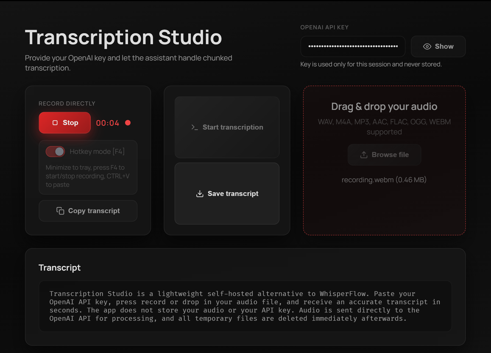

# Transcription Studio


**Record or upload audio and get a text transcript — powered by your own OpenAI API key.** 


## ⬇️ Download

### [Download Transcription Studio for Windows — v1.1.0](https://github.com/JurajMa/transcription/releases/download/v1.1.0/TranscriptionStudio_Setup_1.1.0.exe)

One-click installer · Windows 10+ · No Python required. · You only pay OpenAI per use, this app is free




> **🔑 Bring Your Own Key (BYOK)** — You need your own OpenAI API key to use this app. Get one at [platform.openai.com/api-keys](https://platform.openai.com/api-keys). This means you:
> - Always use the **latest state-of-the-art transcription models**
> - **Control your own usage and costs** directly through OpenAI. **This app is free**, you only pay OpenAI for transcription
> - Pay **far less** than with subscription-based transcription services
>
> ⚠️ **Always [set usage limits](https://platform.openai.com/settings/organization/limits) on your API key. Your API key is sent directly to OpenAI and not stored anywhere. Paste at your own risk — never share this app with untrusted users.**

## Why use this?

Transcription Studio is a lightweight, self-hosted alternative to Wispr Flow. Paste your OpenAI API key, press record or drop in your audio file, and receive an accurate transcript in seconds. The app **does not store your audio or your API key** — audio is sent directly to the OpenAI API for processing and all temporary files are deleted immediately afterwards.

| | Transcription Studio | Wispr Flow |
|---|---|---|
| **Cost** | This app is free, Pay-per-use for the model directly via your own OpenAI API key (🥜) | Monthly subscription |
| **Setup** | One-click install + API key | Download desktop app, create account |
| **Privacy** | Audio sent to OpenAI API only; nothing stored locally | Audio processed by Wispr's servers |
| **Flexibility** | Open-source, customisable, CLI + web UI | Closed-source desktop app |

## Installation

The easiest way to get started is to download the Windows installer from the [Releases](../../releases) page on GitHub. Run the installer, launch the app, paste your OpenAI API key, and start transcribing — no Python or terminal required.

> ⚠️ **Windows SmartScreen warning:** The installer is not code-signed, so Windows may show a warning saying the app is from an "unknown publisher". This is normal for independent software.
>
> **To install:** Click **"More info"** → then click **"Run anyway"**

## How it works

1. Audio is split into overlapping chunks (~4.5 min each) to stay within API limits.
2. Each chunk is sent to the OpenAI transcription API (`gpt-4o-transcribe` by default).
3. Overlapping text between chunks is automatically deduplicated.
4. The final stitched transcript is displayed and can be copied or downloaded.

## Features

- 🎙️ **Record directly** in the app or drag & drop / upload audio files
- 🎵 **Multi-format support** — WAV, M4A, MP3, MP4, AAC, FLAC, OGG, WEBM (auto-converted to WAV)
- 🔐 **Your API key stays private** — entered per-session, never stored or logged
- 🗑️ **No audio storage** — temporary files are cleaned up immediately after transcription
- ⚡ **Intelligent chunking** with overlap and deduplication for seamless long-form transcripts
- 💾 **Copy or save** the transcript as a `.txt` file

## Changelog

### v1.1.0
- Added Windows hotkey mode (`F4`) for start/stop recording while minimized to tray.
- Added tray workflow and on-screen status indicator (recording, success, error).
- Hotkey transcriptions now auto-copy to clipboard when processing completes.

## Privacy & security

- **API key** — entered in the app, sent over HTTPS to the OpenAI API, and discarded after the request. It is never written to disk or logged.
- **Audio data** — uploaded audio is held in a temporary file only for the duration of processing. It is sent to the OpenAI API for transcription and then immediately deleted. The app does not retain, log, or transmit your audio anywhere else.
- **Transcripts** — displayed in the app. Nothing is saved unless you explicitly save or copy the text.

## Disclaimer

THIS SOFTWARE IS PROVIDED "AS IS", WITHOUT WARRANTY OF ANY KIND, EXPRESS OR IMPLIED, INCLUDING BUT NOT LIMITED TO THE WARRANTIES OF MERCHANTABILITY, FITNESS FOR A PARTICULAR PURPOSE, AND NON-INFRINGEMENT.

**IN NO EVENT SHALL THE AUTHOR BE LIABLE FOR ANY CLAIM, DAMAGES, OR OTHER LIABILITY**, WHETHER IN AN ACTION OF CONTRACT, TORT, OR OTHERWISE, ARISING FROM, OUT OF, OR IN CONNECTION WITH THE SOFTWARE OR THE USE OR OTHER DEALINGS IN THE SOFTWARE. THIS INCLUDES, WITHOUT LIMITATION, ANY DIRECT, INDIRECT, INCIDENTAL, SPECIAL, CONSEQUENTIAL, OR PUNITIVE DAMAGES, INCLUDING BUT NOT LIMITED TO LOSS OF DATA, LOSS OF PROFITS, BUSINESS INTERRUPTION, OR ANY FINANCIAL LOSSES.

By using this software, you acknowledge and agree that:

- **You are solely responsible for your OpenAI API key.** The author is not responsible for any unauthorised access to, misuse of, or charges incurred on your API key, whether resulting from your own actions, third-party access, security breaches, or any other cause.
- **You are solely responsible for all costs** incurred through the OpenAI API. The author has no control over and accepts no liability for API pricing, usage charges, or billing disputes.
- **You are solely responsible for the security of your system and network.** The author makes no guarantees regarding the security of data in transit or at rest and is not liable for any data breaches, interceptions, or leaks.
- **You are solely responsible for compliance** with all applicable laws, regulations, and third-party terms of service (including OpenAI's usage policies) in your jurisdiction.
- **Audio data and transcripts** are processed at your own risk. The author is not responsible for the accuracy, completeness, or suitability of any transcription output.
- **The author does not provide any technical support, security guarantees, or uptime commitments** for this software.

Use of this software is entirely at your own risk.

## License

© Juraj Mavračić 2025. All rights reserved.

This software is proprietary. No part of this software may be reproduced, distributed, or transmitted in any form or by any means without the prior written permission of the author, except for personal, non-commercial use as made available through official releases.

---

# For Developers

Everything below is for developers who want to run from source, use the CLI, or build the desktop app themselves.

## Running from source

### 1. Install dependencies

```bash
# Create a virtual environment (conda or venv)
conda create -n transcription python=3.11 && conda activate transcription
# Or: python -m venv .venv && source .venv/bin/activate

pip install -r requirements.txt
```

**FFmpeg** is required for non-WAV audio conversion:
- **Windows:** `conda install -c conda-forge ffmpeg`
- **macOS:** `brew install ffmpeg`
- **Linux:** `sudo apt install ffmpeg`

### 2. Launch the web app

```bash
uvicorn app:app --reload
```

Open [http://localhost:8000](http://localhost:8000), paste your OpenAI API key, and start transcribing.

### 3. Or use the CLI

```bash
export OPENAI_API_KEY="your_key_here"       # Linux / macOS
# set OPENAI_API_KEY=your_key_here          # Windows

python transcribe_audio.py path/to/audio.wav
```

CLI options:

| Flag | Description |
|---|---|
| `--output PATH` | Custom output file path |
| `--no-save` | Print transcript to stdout without saving |
| `--keep-chunks` | Keep intermediate chunk files for inspection |

> **Note:** The CLI currently accepts WAV files only. For other formats, use the web UI or pre-convert with FFmpeg.

## Project structure

```
├── app.py                  # FastAPI web server
├── transcribe_audio.py     # CLI entry point
├── transcription/
│   ├── __init__.py
│   └── service.py          # Core chunking & transcription logic
├── static/
│   ├── index.html          # Web UI
│   ├── styles.css
│   └── app.js
└── requirements.txt
```

## Desktop packaging

Transcription Studio can be packaged as a standalone desktop application for **Windows** and **macOS**. The desktop app opens in a native OS window (not a browser) and includes all dependencies—users don't need Python, pip, or a terminal.

### Prerequisites

#### 1. Install build dependencies

```bash
pip install -r requirements-build.txt
```

#### 2. Download ffmpeg

You need a **static ffmpeg build** to bundle with the app:

- **Windows**: Download from [ffmpeg.org/download.html](https://ffmpeg.org/download.html) (get the "essentials" build)
  - Extract `ffmpeg.exe` and place it in the project root directory
- **macOS**: Download from [ffmpeg.org/download.html](https://ffmpeg.org/download.html) (get the static build)
  - Extract the `ffmpeg` binary and place it in the project root directory

#### 3. Uncomment the ffmpeg line in the spec file

Before building, edit the appropriate `.spec` file (`build_windows.spec` or `build_mac.spec`) and **uncomment** the ffmpeg binary line:

```python
# In build_windows.spec:
binaries=[
    ('ffmpeg.exe', '.'),  # <-- Uncomment this line
],

# In build_mac.spec:
binaries=[
    ('ffmpeg', '.'),  # <-- Uncomment this line
],
```

### Building

#### Option 1: Use the build script (recommended)

```bash
python scripts/build.py
```

The script will:
- Detect your OS (Windows or macOS)
- Check that ffmpeg and PyInstaller are available
- Run the appropriate PyInstaller spec file
- Print the output location

#### Option 2: Run PyInstaller directly

**Windows:**
```bash
pyinstaller build_windows.spec
```

**macOS:**
```bash
pyinstaller build_mac.spec
```

### Output

After building, you'll find the packaged app in:

```
dist/TranscriptionStudio/
```

- **Windows**: `dist/TranscriptionStudio/TranscriptionStudio.exe` — double-click to run
- **macOS**: `dist/TranscriptionStudio.app` — double-click to run

You can distribute the entire `dist/TranscriptionStudio/` folder to users. They can run the app without installing Python or any other dependencies.

### Important Notes

- **Cross-compilation is not supported**: You must build ON Windows for Windows, and ON macOS for macOS
- **macOS Gatekeeper warning**: Users will see a security warning unless you code-sign the app with an Apple Developer certificate
  - To bypass for testing: Right-click the app → "Open" → click "Open" in the dialog
  - For distribution, you should sign the app: `codesign -s "Developer ID Application: Your Name" TranscriptionStudio.app`
- **Windows antivirus**: Some antivirus software may flag the `.exe` as suspicious (false positive)
  - This is common with PyInstaller apps—consider code-signing the executable
- **App size**: The bundled app will be ~100-200 MB due to Python runtime, dependencies, and ffmpeg

### Troubleshooting

- **"ffmpeg not found" error**: Make sure you downloaded the ffmpeg binary, placed it in the project root, and uncommented the line in the `.spec` file
- **Import errors**: Make sure all dependencies are installed (`pip install -r requirements.txt`)
- **Build fails on macOS**: You may need to install Xcode Command Line Tools (`xcode-select --install`)
